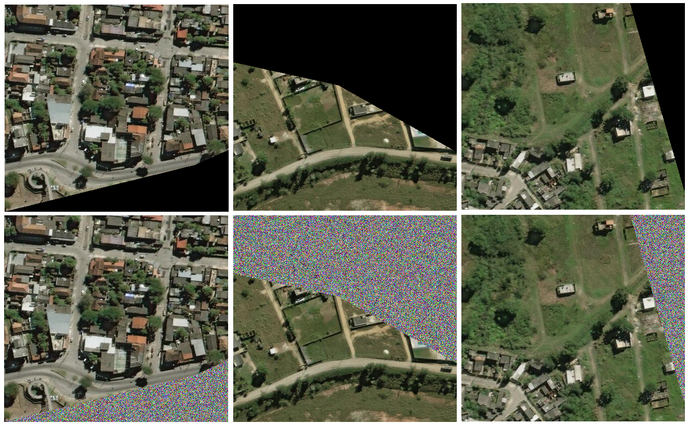
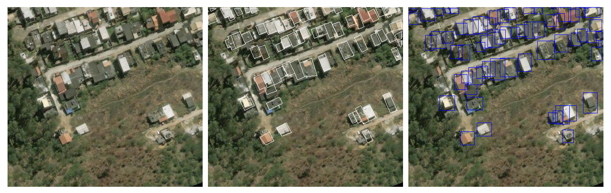
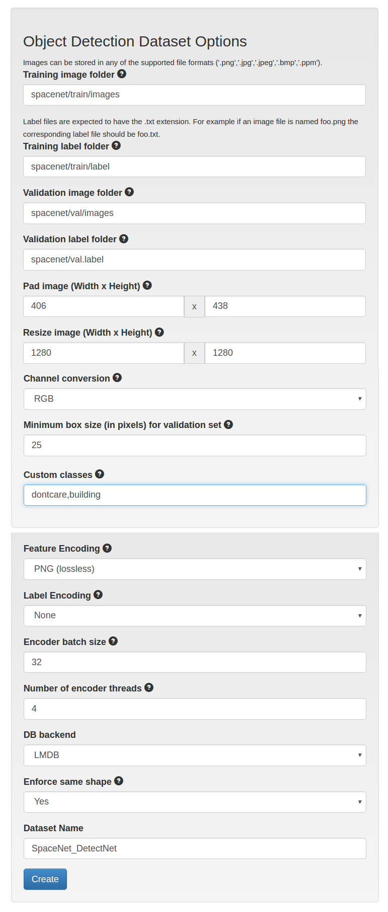
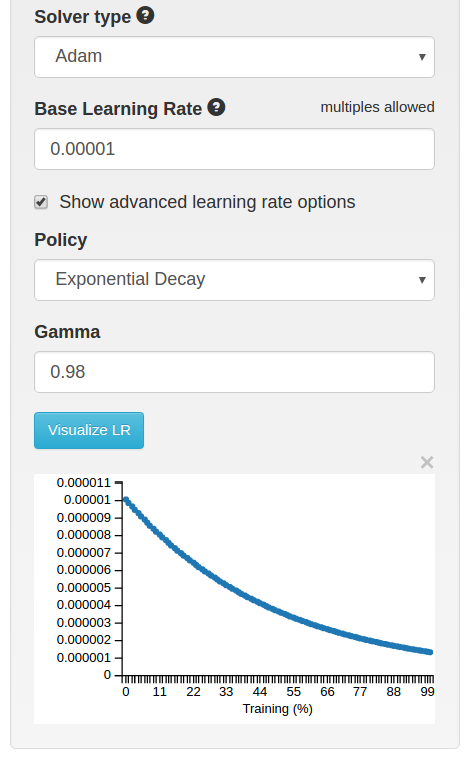
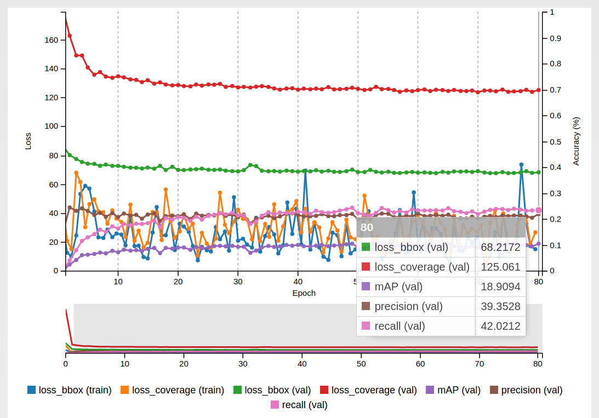
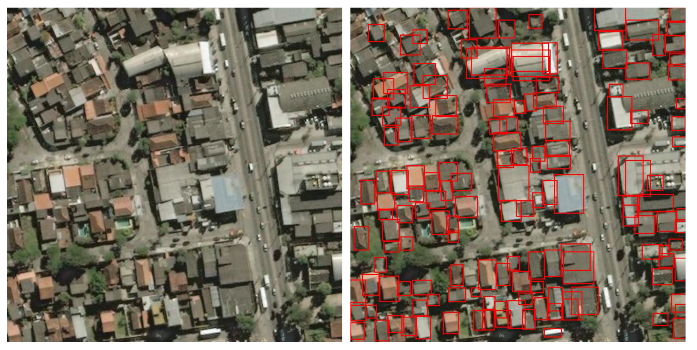
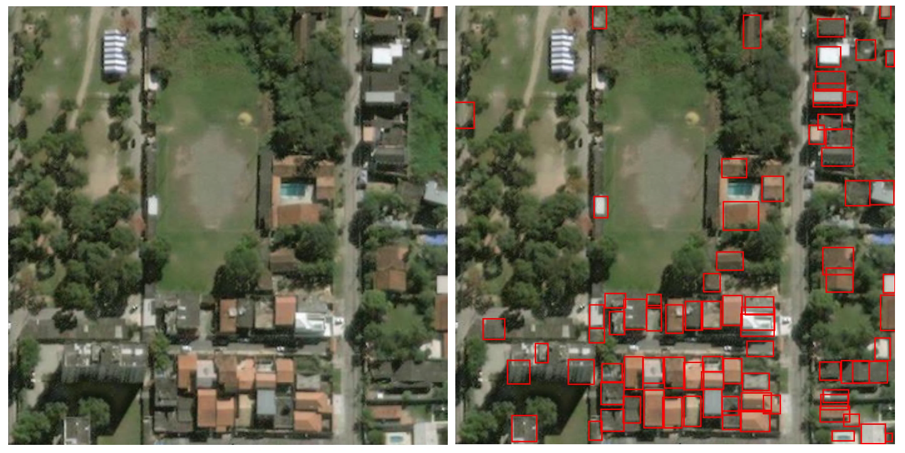
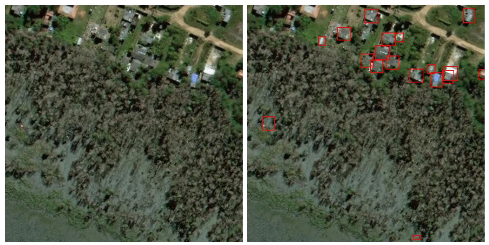
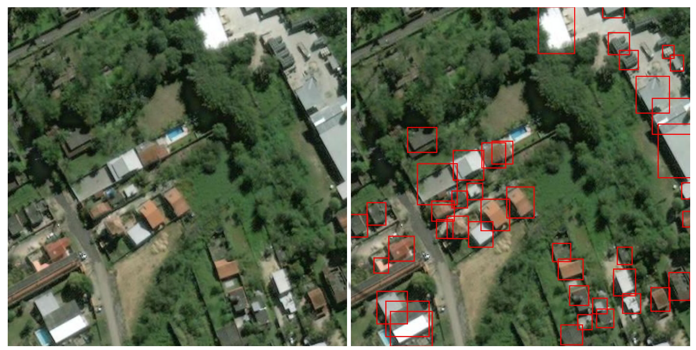
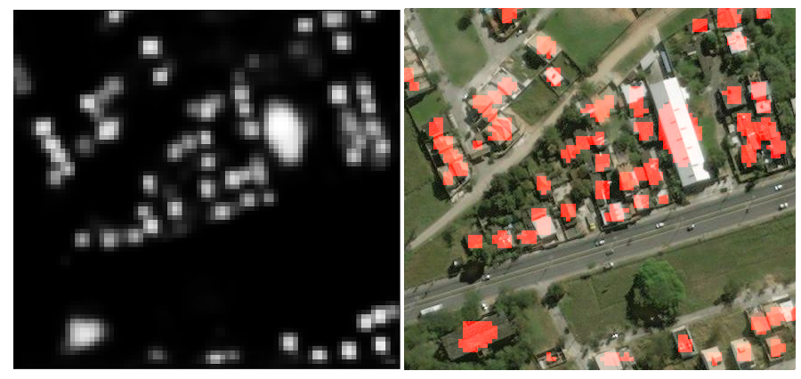

# Detection Tutorial Using The SpaceNet Data

DigitalGlobe, CosmiQ Works, and NVIDIA released satellite image dataset of Rio De Janeiro. A blog post with more information about the dataset and preliminary detection and segmentation results are posted [here](https://devblogs.nvidia.com/parallelforall/exploring-spacenet-dataset-using-digits). This tutorial discusses how the detection results were generated in greater detail allowing others to duplicate the results and acts as a starting point for improving accuracy. The general process and network configuration is based on NVIDIA's DetectNet [example](https://github.com/NVIDIA/DIGITS/tree/master/examples/object-detection).

## Hardware and Software
This test configuration is comprised of a NVIDIA Tesla M60 GPU installed in a server. with a OpenStack virtual machine. Any NVIDIA GPU can be used for this, such as NVIDIA's DIGITS DevBox with Titan X GPUs or a server with Tesla M40s. DIGITS 4 with NVIDIA's Caffe branch version 15 is the application and framework used to generate these results. Other frameworks such as Torch could be used as well but were not explored here. DIGITS 4 with all of its dependencies can be installed with prebuilt packages from [NVIDIA's developer zone](https://developer.nvidia.com/digits). It can also be installed from source with the instructions [here](https://github.com/NVIDIA/DIGITS).

## Dataset Preparation
The data is prepared before being used to train a neural network. The first step was filtering out images with minimal content. Some regions are entirely omitted from the images and appear as black or blank space. No terrain information is present and pixels are zero in each color band. All of the images with blank regions occupying more than 50% of the image are omitted from the data set. Gaussian noise is inserted into the blank regions of the image if it is above the 50% threshold. After filtering the dataset by this metric is it reduced from over 7000 to approximately 4000. Three example images with blank regions less than 50% are in the Figure 1.

Figure 1. Three example images in the data set with blank regions. The second row shows the same image after Gaussian noise has been applied.

Labels for this data are the buildings. The latitude and longitude coordinates are provided for each building in each image and need to be converted to pixel space before being used for training. The BEE-Sharp script convert_Kaggle.py (check file name) converts the coordinate data to pixels. The boundaries of each building are used to create a bounding box that encompasses the entire structure. An example input image with the coordinate information and resulting bounding box is in Figure 2. The building coordinates are plotted as white lines in the center image and the bounding boxes created from these are in the right in blue. All the bounding boxes are quadrilateral with sides parallel to the image edges, excluding rotations. This results in overlap when buildings are close in proximity and not parallel to the image's edges.

Figure 2. Example of a input image with building coordinate information and resulting bounding boxes.

After the filtering  is complete and labels created the data is formatted for ingestion into DIGITS. Each image name is a numerical string and its label has the exact same name minus the extension. For example one image titled "000001.png" has a corresponding label file "000001.txt." Each label file is comprised of pixel coordinate information for each building and each line represents a single building. The first string in the line is the class of the object and the other values are the left, top, right, bottom pixel coordinates. More information on the label format for object detection can be found [here](https://github.com/NVIDIA/DIGITS/blob/v4.0.0/digits/extensions/data/objectDetection/README.md).

<pre></code>
building 0.0 0 0.0 122.0 2.0 131.0 6.0 0.0 0.0 0.0 0.0 0.0 0.0 0.0
building 0.0 0 0.0 368.0 110.0 398.0 137.0 0.0 0.0 0.0 0.0 0.0 0.0 0.0
building 0.0 0 0.0 386.0 133.0 401.0 147.0 0.0 0.0 0.0 0.0 0.0 0.0 0.0
building 0.0 0 0.0 173.0 210.0 198.0 238.0 0.0 0.0 0.0 0.0 0.0 0.0 0.0
building 0.0 0 0.0 144.0 229.0 174.0 257.0 0.0 0.0 0.0 0.0 0.0 0.0 0.0
building 0.0 0 0.0 237.0 173.0 262.0 207.0 0.0 0.0 0.0 0.0 0.0 0.0 0.0
building 0.0 0 0.0 258.0 120.0 286.0 153.0 0.0 0.0 0.0 0.0 0.0 0.0 0.0
</code></pre>

Once this is complete all of the image and label filenames are comprised of matching numerical strings and are stored in their own directories. Path examples are in the image below in Figure 3. The train and validation folders each have a image and label directory. The channel conversion is set to RGB with PNG lossless encoding. The image dimensions and resize dimensions are also defined on this page. The image size is 439 x 406 and is resized up to 1280 x 1280. This page is accessed by going to Datasets and selecting Object Detection.

Figure 3. Dataset creation settings in DIGITS.

## Object Detection Maximum
At the time this work was performed, a limit to the number of objects that can be in each input image is present. This is set to 50 but many of the SpaceNet images contain more than 350 buildings. To account for this the parameter MAX_BOXES is increased to 450. This parameter is defined in two files in CAFFE_ROOT/python/caffe/layers/detectnet,
 clustering.py and mean_ap.py. Once this parameter is modified in both files training can begin. I performed this modification to Caffe while DIGITS was still running but no training was being performed on my hardware.

## Network Configuration and Training Parameters
The default DetectNet network configuration with some minor modifications is used for training this data. This network is comprised of data augmentation layers for preprocessing data, modified version of the [GoogleNet](http://arxiv.org/abs/1409.4842)  CNN, and post-processing layers to predict object locations. The DetectNet data transformation layers are at the beginning of the network are defined near the beginning of the network configuration. This is defined for both the train and validation data and requires information about the training data. Below is a snippet from my network of this layer for the training set. Two parameters from the default DetectNet network are changed in the code below, image_size_x, image_size_y, and crop_bboxes. Although the image size in the dataset is 1280 x 1280, smaller dimensions 512 x 512 are entered as the image_size to enable random cropping. The main reason for this is to reduce memory usage during training. A M60 is used for this training and has 8 GB of memory, performing random cropping allowed training with larger batch sizes. The crop bounding boxes parameter (crop_bboxes) is set to false. During testing, mAP did not reach a value greater than one when this is set to true.

<pre></code>
layer {
  name: "train_transform"
  type: "DetectNetTransformation"
  bottom: "data"
  bottom: "label"
  top: "transformed_data"
  top: "transformed_label"
  include {
    phase: TRAIN
  }
  transform_param {
    mean_value: 127.0
  }
  detectnet_groundtruth_param {
    stride: 16
    scale_cvg: 0.4
    gridbox_type: GRIDBOX_MIN
    min_cvg_len: 20
    coverage_type: RECTANGULAR
    image_size_x: 512
    image_size_y: 512
    obj_norm: true
    crop_bboxes: false
  }
</code></pre>

The validation transform layer of network file shown below. The image_size parameters are the dimensions of the input data for the validation transform layer because no cropping on is performed during validation testing. This could be done if desired but was not experimented with by the author.

<pre><code>
layer {
  name: "val_transform"
  type: "DetectNetTransformation"
  bottom: "data"
  bottom: "label"
  top: "transformed_data"
  top: "transformed_label"
  include {
    phase: TEST
  }
  transform_param {
    mean_value: 127.0
  }
  detectnet_groundtruth_param {
    stride: 16
    scale_cvg: 0.4
    gridbox_type: GRIDBOX_MIN
    min_cvg_len: 20
    coverage_type: RECTANGULAR
    image_size_x: 1280
    image_size_y: 1280
    obj_norm: true
    crop_bboxes: false
  }
}
</pre></code>

As mentioned previously, the CNN is a modified version of GoogleNet and the output is a feature map rather than a vector that predicts a class for the overall image. The layers after the CNN are python layers and are used to predict bounding boxes based on output feature map from the CNN. These layer names and types are unchanged relative to the DetectNet's default configuration but the parameters are different. The image dimensions match this data set for each layer, 1280 x 1280, rather than the default 348 x 1248.

The cluster layer requires five parameters to predict building locations. This uses the function [groupRectangles from OpenCV](http://docs.opencv.org/2.4/modules/objdetect/doc/cascade_classification.html#grouprectangles) to generate a list of bounding boxes. To ascertain the results presented here, 0.06, 3, and 0.02 were used for the thresholds and equivalence (eps) parameters. This clusters the input rectangles using the rectangle equivalence criteria (eps) combining rectangles with similar sizes and locations. In cases where the cluster of boxes is less than the group threshold small clusters containing less than or equal to gridbox_rect_threshold are omitted. Predicted rectangles are the average of box clusters greater than this parameter. The minimum height is the last parameter provided to the cluster Python layer and is 10 in the layer section presented below.

<pre><code>
layer {
  name: "cluster"
  type: "Python"
  bottom: "coverage"
  bottom: "bboxes"
  top: "bbox-list"
  include {
    phase: TEST
  }
  python_param {
    module: "caffe.layers.detectnet.clustering"
    layer: "ClusterDetections"
    parameters - img_size_x, img_size_y, stride,
      gridbox_cvg_threshold, gridbox_rect_threshold, gridbox_rect_eps, min_height
    param_str: "1280, 1280, 16, 0.06, 3, 0.02, 10"
  }
}
layer {
  name: "cluster_gt"
  type: "Python"
  bottom: "coverage-label"
  bottom: "bbox-label"
  top: "bbox-list-label"
  include {
    phase: TEST
  }
  python_param {
    module: "caffe.layers.detectnet.clustering"
    layer: "ClusterGroundtruth"
    param_str: "1280, 1280, 16"
  }
}
</pre></code>

A copy of the entire network file can be downloaded [here](models/train_val.prototxt).

Like in the DetectNet tutorial this network is finetuned with a pretrained GoogleNet network that has been trained on the [ImageNet Large Scale Visual Recognition Competition (ILSVRC)](http://image-net.org/) 2012 dataset. The Adam solver is used with a exponential decay learning policy and initial learning rate of 1e-05 is used for training. These are entered into the DIGITS model page and can be reached by going to Models and then selecting Object Detection in the DIGITS main console page. If these values are used the mAP, recall, precision values above zero occurs within 5 epochs. Although the these metrics reach values greater than zero the loss values are still high. There is still plenty of room for improvement with the network configuration and training settings.

Figure 4. Training parameters entered into DIGITS.

## Results
Shortly after training begins the mAP, recall, and precision begin to increase. For my experimentation the mAP reached approximately nineteen after eighty epochs, as shown in Figure 5. Example detection results from the test set are shown below. With the few changes described here to the default DetectNet network many of the buildings are identified. Some buildings are missed by the network and this is most noticeable with the larger buildings and ones with a non-rectangular shape. One example of this is discernible in the second image with the U-shaped building, it is detected as three discrete ones instead of one.  

Figure 5. Training results.

Figure 6. Example detection results from the test set.

## Summary

A variety of different settings were tested before these results were achieved. In some cases, the mAP never reached above zero. When troubleshooting, I visualized the trained network's response by classifying an image and inspecting the network weights and responses. If the weights visually appeared to be close to zero then I assumed that the network was not learning on the data and I needed to adjust a parameter(s) in my configuration. I also looked closely at the coverage layer at the end of the network.  For more quantitative assessments on this layer relative to the input, the trained network is downloaded and this layer was overlayed onto the input image. An example of great alignment between the coverage layer and buildings is presented in the figure below.
If the network was learning and responses in the feature map correlated to regions with buildings then I would adjust the cluster layer parameters such as the threshold to improve the bounding box predictions.

Figure 7. Coverage layer output compared to example input image.

With a few changes to the DetectNet network a deep neural network can be trained to identify buildings in this dataset. This configuration is not perfect and there is room for improvement and these results can be used as a starting point for others.

##References
Redmon, J., Divvala, S., Girshick, R., and Farhadi, A. 2015. You Only Look Once: Unified, Real-Time Object Detection. arXiv [cs.CV]. http://arxiv.org/abs/1506.02640.

Szegedy, C., Liu, W., Jia, Y., et al. 2014. Going Deeper with Convolutions. arXiv [cs.CV]. http://arxiv.org/abs/1409.4842.
