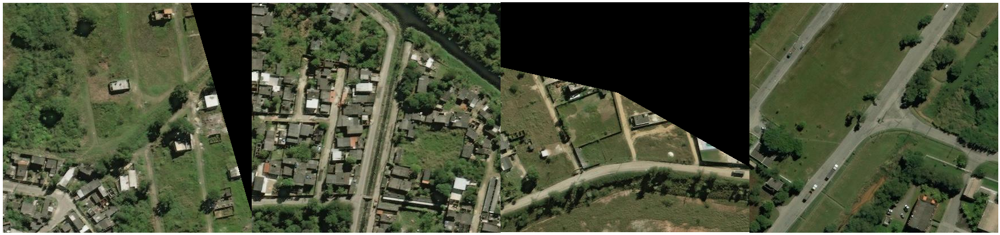
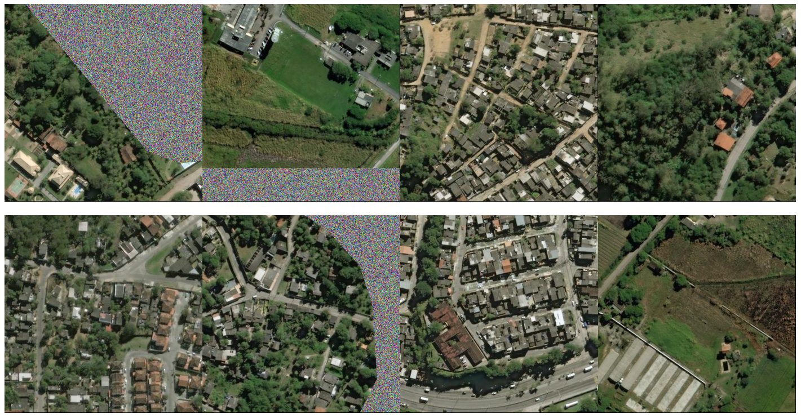

# DetectionTutorialSpaceNet
This is a tutorial on training a network to detect buildings with the SpaceNet data.

## Introduction
Recently DigitalGlobe released aerial image dataset of Rio De Janeiro. This unprecedented data set includes fully developed regions with residential and commercial buildings as well as rural areas with none at all. The perimeter and shape of each building is provided with latitude and longitude coordinates. acting as the labels for performing building detection. A blog post with preliminary detection results is posted [here](https://devblogs.nvidia.com/parallelforall/exploring-spacenet-dataset-using-digits). This tutorial discusses how the detection results were achieved in greater detail so that readers can duplicate the presented results presented and act as a starting point for improving mean average precision (mAP), recall and precision.

## Hardware and Software
NVIDIA GPUs and open source software, Deep Learning GPU Training System, DIGITS version 4 is used to create these results.
NVIDIA Caffe branch version 15
M60 GPU is used here because it has two discrete GPUs and allowed me to do two trainings in parallel while experimenting with different network parameters. Both could just as easily used together for multi-gpu training to reduce training time.

## Dataset Preparation
The latitude and longitude coordinates act as the labels for the data. These coordinates need to be converted to pixel space before being used for training.
Over XXX images are provided with building information.
The BEE-Sharp script xxx.py was used to convert the latitude and longitude coordinates to pixel space. Then the boundaries of the building is used to create a bounding box that encompasses the building.

Omit images that have less than 50% pixel information and then fill it in with Gaussian noise. After filtering the dataset by this metric is it reduced from over 7000 to approximately 4000.  

After filtering the images the training, validation and test set were created. Roughly 3500 images remain in the training set and the rest is split between the validation and test set.

The three band images are contain three color bands red, blue, and green and have width and height of 438 and 406. When creating the dataset using DIGITS the images are resized up to 1280x1280 to increase the build size. This increases the buildings to a range that is well suited for DetectNet, 100x100 up to roughly 400x400.

## Network Configuration
The default DetectNet network configuration with a some minor modifications is used to train the network. The DetectNet data transformation layers are defined near the beginning of the network. This is defined for both the train and validation data and requires information about the training data. Below is a snippet from my network for the training set. Two parameters from the default DetectNet network are changed in the code below, image_size_x, image_size_y, and [crop_bboxes, do we know what this does?]. Although the image size is 1280x1280, smaller dimensions 512x512 are entered as the image_size to define dimensions for random cropping. The main reason for this is to reduce memory usage during training.

<pre></code>
layer {
  name: "train_transform"
  type: "DetectNetTransformation"
  bottom: "data"
  bottom: "label"
  top: "transformed_data"
  top: "transformed_label"
  include {
    phase: TRAIN
  }
  transform_param {
    mean_value: 127.0
  }
  detectnet_groundtruth_param {
    stride: 16
    scale_cvg: 0.4
    gridbox_type: GRIDBOX_MIN
    min_cvg_len: 20
    coverage_type: RECTANGULAR
    image_size_x: 512
    image_size_y: 512
    obj_norm: true
    crop_bboxes: false
  }
</code></pre>

Then for validation transform layer I do not do any cropping and the image_size parameters are equal to the size of my images.

<pre><code>
layer {
  name: "val_transform"
  type: "DetectNetTransformation"
  bottom: "data"
  bottom: "label"
  top: "transformed_data"
  top: "transformed_label"
  include {
    phase: TEST
  }
  transform_param {
    mean_value: 127.0
  }
  detectnet_groundtruth_param {
    stride: 16
    scale_cvg: 0.4
    gridbox_type: GRIDBOX_MIN
    min_cvg_len: 20
    coverage_type: RECTANGULAR
    image_size_x: 1280
    image_size_y: 1280
    obj_norm: true
    crop_bboxes: false
  }
}
</pre></code>

This network is modified version of GoogleNet. The layers after the CNN are python layers and are used to predict boudning boxes based on output feature map from the network. The python layers determine building candidates in the data. These layer names and types are unchanged relative to the DetectNet's default configuration, but the parameters are different. The image dimensions match this data set for each layer. The cluster layers requires five parameters that are used to predict building locations. This uses a function 

<pre><code>
layer {
  name: "cluster"
  type: "Python"
  bottom: "coverage"
  bottom: "bboxes"
  top: "bbox-list"
  include {
    phase: TEST
  }
  python_param {
    module: "caffe.layers.detectnet.clustering"
    layer: "ClusterDetections"
    param_str: "1280, 1280, 16, 0.06, 3, 0.02, 10,1"
  }
}
layer {
  name: "cluster_gt"
  type: "Python"
  bottom: "coverage-label"
  bottom: "bbox-label"
  top: "bbox-list-label"
  include {
    phase: TEST
  }
  python_param {
    module: "caffe.layers.detectnet.clustering"
    layer: "ClusterGroundtruth"
    param_str: "1280, 1280, 16"
  }
}
</pre></code>
## Training with DIGITS
Creating the Dataset and Training with DIGITS

## Results
